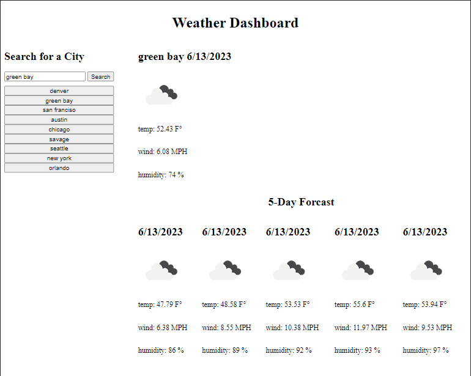

# Weather-Dasboard

A basic website powered by the openweather API, to take in user-entered cities and output the weather for the current day and a 5 day forcast. this is done by using openweather to convert a location to its latitude and longitude values and fetching the needed info.

## Deployed MVP
  
[https://maxwell-leu.github.io/Weather-Dasboard/](https://maxwell-leu.github.io/Weather-Dasboard/)
